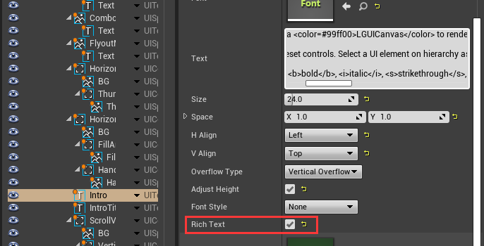

## RichText

Check "Rich Text" property in UIText to make it work:

#### Suported tags
|Tag|Description|Example
|-|-|-
|b|Renders the text in boldface.|This is a &#60;b&#62;LGUI&#60;/b&#62; example.
|i|Renders the text in italics.|This is a &#60;i&#62;LGUI&#60;/i&#62; example.
|u|Renders the text with underline.|This is a &#60;u&#62;LGUI&#60;/u&#62; example.
|s|Renders the text with strikethrough.|This is a &#60;s&#62;LGUI&#60;/s&#62; example.
|size|Sets the size of the text according to the parameter value.|This is a &#60;size=18&#62;LGUI&#60;/size&#62; example. This is a &#60;size=+4&#62;LGUI&#60;/size&#62; example. This is a &#60;size=-4&#62;LGUI&#60;/size&#62; example.
|color|Sets the color of the text according to the parameter value. The color can be specified in the traditional HTML format. #rrggbbaa ...where the letters correspond to pairs of hexadecimal digits denoting the red, green, blue and alpha (transparency) values for the color. For example, cyan at full opacity would be specified by color=#00ffffff...  Another option is to use the name of the color, This is easier to understand but naturally, the range of colors is limited and full opacity is always assumed. The sheet blow shows supported color name.|This is a &#60;color=#ff000000&#62;LGUI&#60;/color&#62; example. This is a &#60;color=red&#62;LGUI&#60;/color&#62; example.
|sup|Renders the text with superscript.|This is a &#60;sup&#62;LGUI&#60;/sup&#62; example.
|sub|Renders the text with subscript.|This is a &#60;sub&#62;LGUI&#60;/sub&#62; example.
|CustomTag|This is useful when you need to select a range of text.|This is a &#60;MyTag&#62;LGUI&#60;/MyTag&#62; example.

#### Suported color names
|Collor name|Hex value|Swatch
|-|-|-
|black|#000000ff|

|white|#ffffffff|

|gray|#808080ff|

|silver|#c0c0c0ff|

|red|#ff0000ff|

|green|#008000ff|

|blue|#0000ffff|

|orange|#ffa500ff|

|purple|#800080ff|

|yellow|#ffff00ff|

