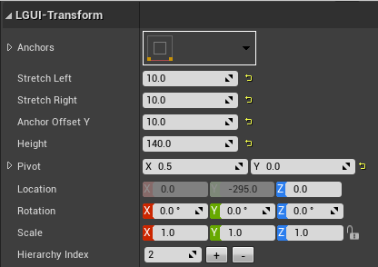

## UIItem

#### 1. Transform related properties

|Property:|Functions:
|:-|:-
|Anchors|The anchor points for the lower left corner and the upper right corner of the rectangle.
|Anchor Offset X/Y|X/Y position of the rectangle's pivot point relative to the anchors. The pivot point is the location around which the rectangle rotates. Not visible if anchor set to stretch or none.
|Width/Height|Size of the rectangle. Not visible if anchor set to stretch.
|Stretch Left/Right/Top/Bottom|Positions of the rectangle's edges relative to their anchors. This can be thought of as padding inside the rectangle defined by the anchors. Visible when anchor set to stretch.
|Pivot|Location of the pivot point around which the rectangle rotates, defined as a fraction of the size of the rectangle itself. 0,0 corresponds to the lower left corner while 1,1 corresponds to the upper right corner.
|Location|SceneComponent's location. X/Y is controlled by LGUI if anchor is not none.
|Rotation, Scale|SceneComponents's rotation and scale.
|Hierarchy Index|Mostly used for layout to sort.

#### 2. Other properties

|Property:|Functions:
|:-|:-
|Is UI Active|Active ui is visible and interactable. If parent or parent's parent... IsUIActive is false, then this ui is not visible and not interactable.
|Depth|Higher depth render on top of lower one, and receive raycast before lower one.
|Color|Render color of UI element. Color may be override by UISelectable(UIButton, UIToggle, UISlider ...), if UISelectable's transition set to "Color Tint".
|Inherit Alpha|Alpha inherit from parent.
|
|Raycast Target|Raycast Target can receive raycast, means it is ready for interaction. See [Create Button](../../GetStarted/CreateButton/index.md).
|Trace Channel|Trace channel for line trace of interaction. See [Create Button](../../GetStarted/CreateButton/index.md).
|Raycast Complex|Visible if it is a UIRenderable object. Default raycast use rectangle area for raycast, but Raycast Complex use actural mesh for raycast.