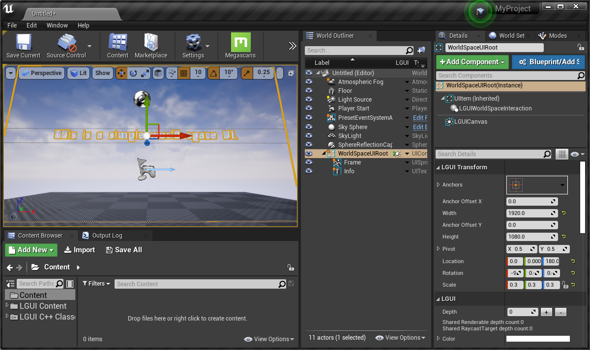
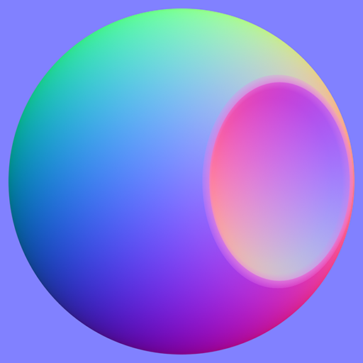
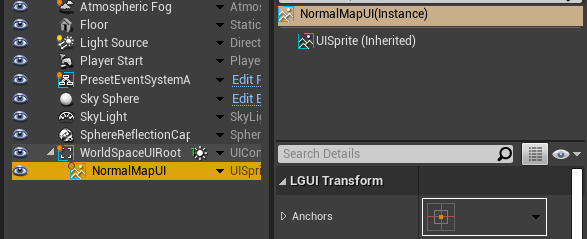
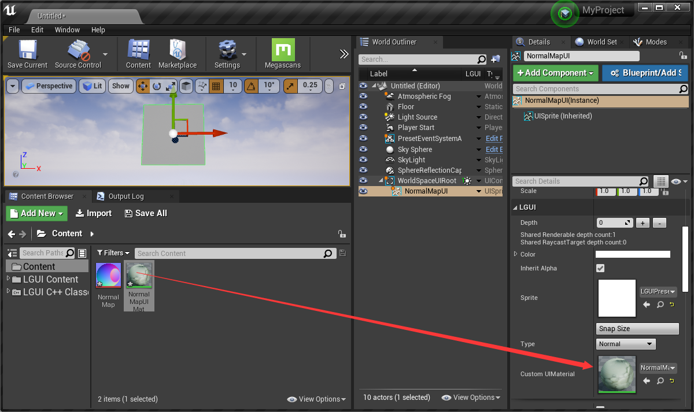
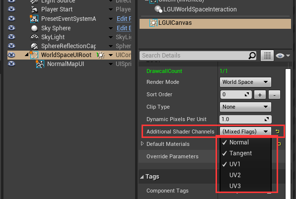
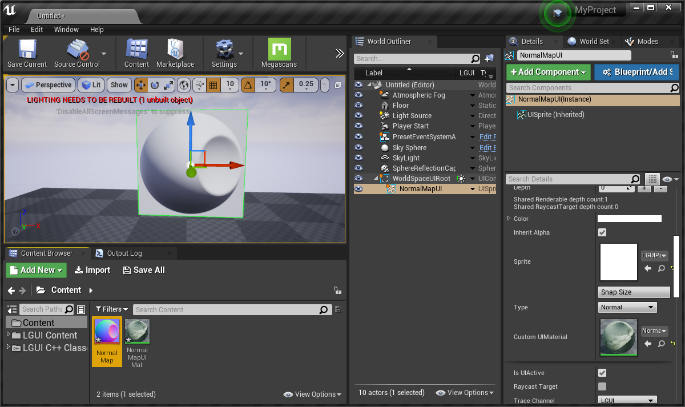

## WorldSpaceUI

WorldSpaceUI use engine's default render pipeline to render UI elements, so no much fancy here.

#### 1. Create WorldSpaceUI
Select "LGUI Tools"->"Basic Setup"->"World Space UI":

Then a "WorldSpaceUIRoot" will be created:

#### 2. Use lighting and normalmap
Prepare a normal map:

Drag the normal map to content folder:

Delete "Frame" and "Info" actor, right click the down arrow button and choose "Create UI Element"->"UISprite", and name it "NormalMapUI":

Create a new material, name it "NormalMapUIMat", make it a very simple material like this:

**UISprite take texcoord0 as packed atlas uv**, so we use texcoord1 as uv input.  
**UISprite will use the atlas texture and set to MainTexture parameter in material**.

Select "NormalMapUI" actor, find "Custom Material" property, and drag the "NormalMapUIMat" to "Custom Material":

The "NormalMapUI" looks not right in the viewport. Because by default, LGUI only set the first texcoord and no normal or tangent data, so we need to tell LGUICanvas to provide more data, by check the "Additional Shader Channels" flags:

Now adjust light angle and position, see the bumped surface on UI:

Check [SampleProject](https://github.com/liufei2008/LGUISampleProject) on github, you will find more infomation about lighing on 3D UI:
