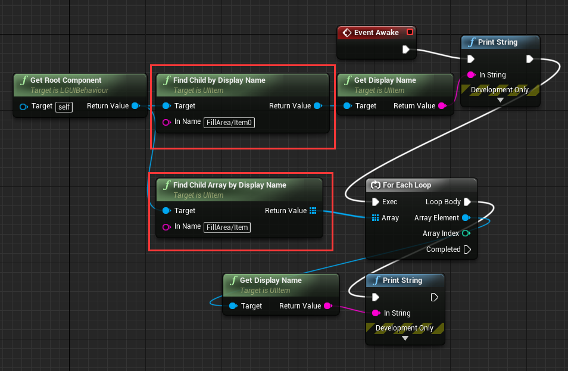

# 根据名字查找子物体
#### 1. UIItem的显示名(DisplayName)
UE引擎的Actor不存在固定的名字，在Outliner显示的名字只是编辑器里可用。但是有时我们需要根据名字来找到UI物体。LGUI的UIItem组件就提供了运行时可用的属性**DisplayName**，跟Outliner显示的Actor名字一致：

#### 2. *DisplayName*相关使用方法：

|方法：|描述：  
|:-|:-
|Find Child by Display Name (In Name)|在子物体中搜索并返回名字与输入名字一致的UIItem。支持多层级的搜索，比如：InName = "Content/ListItem/NameLabel"，*In Name*参数需要注意大小写。
|Find Child Array by Display Name (In Name)|与"Find Child by Display Name"用法一样，不同之处是返回所有符合条件的子物体的数组。

#### 3. 修改UIItem的显示名(DisplayName)
就像之前描述的，UIItem的*DisplayName*跟Outliner显示的Actor的名字一样，所以只需修改Outliner的显示名字就行。
在运行时也可以调用UIItem的*SetDisplayName*方法来修改。
