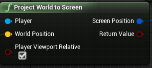

# 世界空间位置投射到LGUI的屏幕空间位置
如果你要做个浮动的血条可能会用到这个知识点。

主要用到两个节点：一个是**Project World to Screen**，可以在引擎自带节点里找到：

另一个是**Convert Position from Viewport to LGUICanvas**，这是LGUICanvasScaler类中提供的节点：  

|属性：|方法：|
|:-|:-|
|Target|LGUICanvasScaler组件物体。
|Position|输入位置，是从**Project World to Screen**节点输出的。
|Return Value|代表LGUI的屏幕空间的位置。注意左下角是0位置，所以如果某个UI元素需要使用这个值，那么它需要把锚点设置到左下角，并且它的父物体只能是全屏尺寸。

我们可以把这些节点连成下图的样子：
  
*Healthbar*是个UIBaseActor物体，代表血条的根物体；*Root*是ScreenSpaceUIRoot的Actor，并且必须要有LGUICanvasScaler组件。
